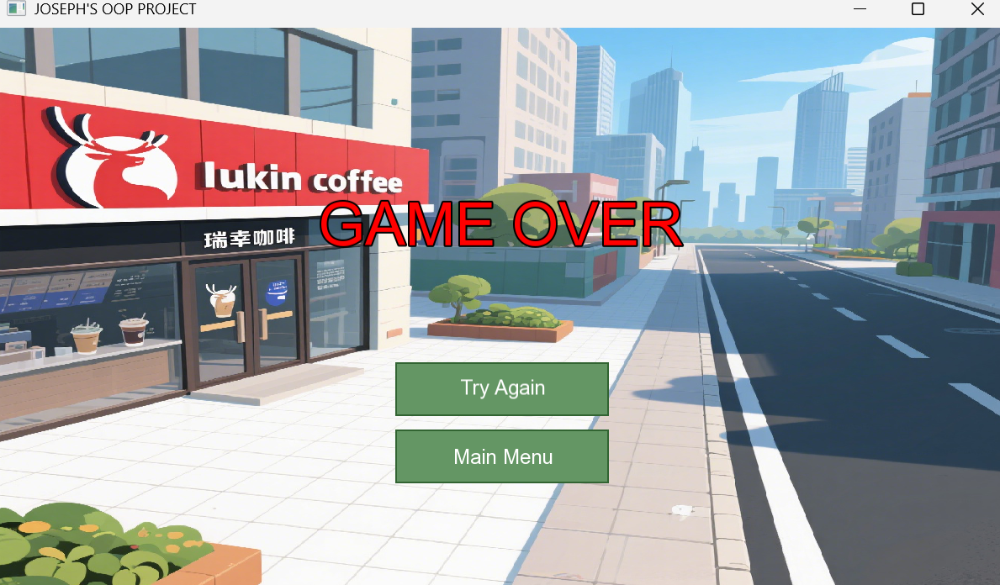

## 一、背景介绍
本项目是基于面向对象编程思想，使用 CMake 作为构建系统，结合 SFML 图形库开发的植物大战僵尸游戏，由于没找到基于sfml库的类似的开源项目，从0开始开发，在游戏中更换了主题和背景以及贴图，但是出于开发的方便（开发的时候还没有想好主题更换为上面），在代码编写的时候仍然基于植物大战僵尸中的如Plant，Zombie等等名词开发，在下列说明中也直接采用植物大战僵尸的名词进行说明。

### 游戏背景：
#### 奶茶宇宙：雪王荣耀保卫战

在一个饮品江湖风起云涌的时代，蜜雪冰城，这位以亲民价格和魔性神曲深入人心的“甜蜜王者”，正面临着前所未有的挑战！

烽烟四起，强敌环伺！喜茶咖啡军团，茶百道特种小队，瑞幸先锋部队，星巴克精英部队等等虎视眈眈，他们各显神通，都想在这场饮品大战中分一杯羹。

面对这波涛汹涌的攻势，蜜雪冰城的守护神——雪王，头戴王冠，手持冰淇淋权杖，屹立不倒！他不是一个人在战斗！

“想攻占我的甜蜜宇宙？先问问我手中的冰淇淋权杖和亿万雪王的粉丝答不答应！”

战斗仍在继续，雪王带领他的蜜雪军团，用冰爽和甜蜜，守护每一寸属于快乐的领土！

<font color="#FF0000">一起来保卫蜜雪冰城吧！</font>

## 二、算法解释

### 1. 核心部分流程图
#### 游戏主循环流程

#### 碰撞检测流程


### 2. 重要代码及实现逻辑解释

#### 游戏主类 `Game.cpp`
```cpp
#include "Game.h"
#include "States/MenuState.h"
#include "../Utils/Constants.h"
#include <iostream>

Game::Game()
    : m_window(sf::VideoMode(WINDOW_WIDTH, WINDOW_HEIGHT),
               WINDOW_TITLE,
               sf::Style::Default),
      m_resourceManager(),
      m_soundManager(),
      m_stateManager(this)
{
    m_window.setFramerateLimit(static_cast<unsigned int>(TARGET_FPS));
    std::cout << "Game object operated!" << std::endl;
    loadGlobalResources();
    m_stateManager.pushState(std::make_unique<MenuState>(&m_stateManager));
    if (m_stateManager.isEmpty())
    {
        std::cerr << "严重错误:没有初始状态被推入 StateManager!" << std::endl;
        m_window.close();
    }
}

// 加载全局资源
void Game::loadGlobalResources()
{
    std::cout << "Game:loading whole resource..." << std::endl;

    if (!m_resourceManager.hasFont(FONT_ID_PRIMARY))
    {
        if (!m_resourceManager.loadFont(FONT_ID_PRIMARY, FONT_PATH_ARIAL))
        {
            if (!m_resourceManager.loadFont(FONT_ID_PRIMARY, FONT_PATH_ARIAL))
            {
                std::cerr << "Game:严重 - 全局主要字体加载失败。" << std::endl;
            }
        }
    }
    if (!m_resourceManager.hasFont(FONT_ID_SECONDARY))
    {
        if (!m_resourceManager.loadFont(FONT_ID_SECONDARY, FONT_PATH_ARIAL))
        {
            std::cerr << "Game:全局次要字体加载失败。某些UI可能会使用主要字体作为备用。" << std::endl;
        }
    }

    // 预加载种子包
    std::cout << "Game: Pre-loading seed packet icons and shovel..." << std::endl;
    if (!m_resourceManager.hasTexture(SUNFLOWER_ICON_TEXTURE_KEY))
    {
        if (!m_resourceManager.loadTexture(SUNFLOWER_ICON_TEXTURE_KEY, "../../assets/images/sunflower.png"))
            std::cerr << "Game: Failed to load " << SUNFLOWER_ICON_TEXTURE_KEY << std::endl;
    }
    if (!m_resourceManager.hasTexture(PEASHOOTER_ICON_TEXTURE_KEY))
    {
        if (!m_resourceManager.loadTexture(PEASHOOTER_ICON_TEXTURE_KEY, "../../assets/images/peashooter.png"))
            std::cerr << "Game: Failed to load " << PEASHOOTER_ICON_TEXTURE_KEY << std::endl;
    }
    if (!m_resourceManager.hasTexture(WALLNUT_ICON_TEXTURE_KEY))
    {
        if (!m_resourceManager.loadTexture(WALLNUT_ICON_TEXTURE_KEY, "../../assets/images/wallnut.png"))
            std::cerr << "Game: Failed to load " << WALLNUT_ICON_TEXTURE_KEY << std::endl;
    }
    if (!m_resourceManager.hasTexture(ICE_PEASHOOTER_ICON_TEXTURE_KEY))
    {
        if (!m_resourceManager.loadTexture(ICE_PEASHOOTER_ICON_TEXTURE_KEY, "../../assets/images/ice_peashooter.png"))
            std::cerr << "Game: Failed to load " << ICE_PEASHOOTER_ICON_TEXTURE_KEY << std::endl;
    }
    if (!m_resourceManager.hasTexture(SHOVEL_TEXTURE_KEY))
    {
        if (!m_resourceManager.loadTexture(SHOVEL_TEXTURE_KEY, "../../assets/images/shovel.png"))
            std::cerr << "Game: Failed to load " << SHOVEL_TEXTURE_KEY << std::endl;
    }
    if (!m_resourceManager.hasTexture(SHOVEL_CURSOR_TEXTURE_KEY))
    {
        // Assuming same image for cursor for now, adjust path if different
        if (!m_resourceManager.loadTexture(SHOVEL_CURSOR_TEXTURE_KEY, "../../assets/images/shovel.png"))
            std::cerr << "Game: Failed to load " << SHOVEL_CURSOR_TEXTURE_KEY << std::endl;
    }

    // 背景音乐
    if (!m_soundManager.loadMusic(BGM_GAMEPLAY, "../../assets/audio/gameplay_music.mp3"))
    {
        std::cerr << "Game: Failed to load gameplay background music!" << std::endl;
    }
    std::cout << "Game:全局资源加载尝试完毕。" << std::endl;
}

void Game::run()
{
    sf::Clock clock;
    sf::Time timeSinceLastUpdate = sf::Time::Zero;

    while (m_window.isOpen())
    {
        sf::Time elapsedTime = clock.restart();
        timeSinceLastUpdate += elapsedTime;

        while (timeSinceLastUpdate > TIME_PER_FRAME)
        {
            timeSinceLastUpdate -= TIME_PER_FRAME;

            processEvents();
            update(TIME_PER_FRAME);
        }

        render();

        if (m_stateManager.isEmpty())
        {
            m_window.close();
        }
    }
}

void Game::processEvents()
{
    sf::Event event;
    while (m_window.pollEvent(event))
    {
        if (event.type == sf::Event::Closed)
        {
            m_window.close();
        }
        m_stateManager.handleEvent(event);
    }
}

void Game::update(sf::Time deltaTime)
{
    m_stateManager.update(deltaTime.asSeconds());
}

void Game::render()
{
    m_window.clear(sf::Color(50, 50, 50));

    m_stateManager.render(m_window);

    m_window.display();
}

ResourceManager &Game::getResourceManager()
{
    return m_resourceManager;
}

StateManager &Game::getStateManager()
{
    return m_stateManager;
}

sf::RenderWindow &Game::getWindow()
{
    return m_window;
}
SoundManager &Game::getSoundManager()
{
    return m_soundManager;
}
```
**实现逻辑解释**：
- `Game` 类作为游戏的核心控制器，在构造函数中完成游戏窗口、资源管理器、音效管理器和状态管理器的初始化，并加载全局资源。将初始状态（菜单状态）推入状态管理器，确保游戏有正确的起始状态。
- `loadGlobalResources` 方法负责加载游戏所需的各种资源，包括字体、纹理和背景音乐。通过检查资源是否已加载，避免重复加载，提高资源管理效率。
- `run` 方法是游戏的主循环，它不断处理事件、更新游戏状态和渲染游戏画面。使用时钟控制游戏的帧率，确保游戏在不同性能的设备上都能稳定运行。
- `processEvents` 方法处理窗口事件，如关闭窗口和状态管理器的事件处理。通过状态管理器将事件传递给当前活动的状态，实现事件的统一管理。
- `update` 方法更新游戏状态，调用状态管理器的更新方法，确保所有状态都能及时更新。
- `render` 方法清空窗口，渲染当前状态的画面并显示，保证游戏画面的实时更新。

#### 碰撞检测系统 `CollisionSystem.cpp`
```cpp
#include "CollisionSystem.h"
#include "../Entities/Projectile.h"
#include "../Entities/Zombie.h"
#include "../Entities/Plant.h"
#include "ProjectileManager.h"
#include "ZombieManager.h"
#include "PlantManager.h"
#include "../Utils/Constants.h"
#include <iostream>

CollisionSystem::CollisionSystem()
{
}

void CollisionSystem::update(ProjectileManager &projectileManager,
                             ZombieManager &zombieManager,
                             PlantManager &plantManager)
{
    std::vector<Projectile *> activeProjectiles = projectileManager.getAllActiveProjectiles();
    std::vector<Zombie *> activeZombies = zombieManager.getActiveZombies();
    std::vector<Plant *> activePlants = plantManager.getAllActivePlants();

    checkProjectileZombieCollisions(activeProjectiles, activeZombies);
    checkZombiePlantCollisions(activeZombies, activePlants, 0.f);
}

void CollisionSystem::checkProjectileZombieCollisions(std::vector<Projectile *> &projectiles,
                                                      std::vector<Zombie *> &zombies)
{
    for (Projectile *projectile : projectiles)
    {
        if (!projectile || projectile->hasHit())
        {
            continue;
        }
        for (Zombie *zombie : zombies)
        {
            if (!zombie || !zombie->isAlive())
            {
                continue;
            }

            if (projectile->getGlobalBounds().intersects(zombie->getGlobalBounds()))
            {

                float projYCenter = projectile->getPosition().y;

                float zombieSpriteHeight = zombie->getGlobalBounds().height;
                float zombieFeetY = zombie->getPosition().y;
                float zombieHeadY = zombieFeetY - zombieSpriteHeight;
                float yTolerance = projectile->getGlobalBounds().height / 2.f;
                if (projYCenter >= zombieHeadY - yTolerance && projYCenter <= zombieFeetY + yTolerance)
                {

                    // 碰撞发生
                    zombie->takeDamage(projectile->getDamage());
                    projectile->applyPrimaryEffect(zombie);
                    projectile->onHit();
                    break;
                }
            }
        }
    }
}

// 检测僵尸与植物的碰撞
void CollisionSystem::checkZombiePlantCollisions(std::vector<Zombie *> &zombies,
                                                 std::vector<Plant *> &plants,
                                                 float dt)
{
    for (Zombie *zombie : zombies)
    {
        if (!zombie || !zombie->isAlive() || zombie->getCurrentState() == ZombieState::ATTACKING)
        {
            continue;
        }
    }
    (void)dt;
}
```
**实现逻辑解释**：
- `CollisionSystem` 类负责处理游戏中的碰撞检测。`update` 方法获取所有活动的子弹、僵尸和植物，然后分别调用 `checkProjectileZombieCollisions` 和 `checkZombiePlantCollisions` 方法进行碰撞检测。
- `checkProjectileZombieCollisions` 方法遍历所有子弹和僵尸，检查它们的边界矩形是否相交。如果相交且满足一定的垂直位置条件，则认为发生碰撞。碰撞发生时，僵尸受到子弹的伤害，子弹应用其主要效果，并标记为已击中。
- `checkZombiePlantCollisions` 方法遍历所有僵尸和植物，检查僵尸是否与植物发生碰撞。在当前实现中，该方法只是简单地过滤掉无效的僵尸，尚未完成完整的碰撞处理逻辑。

### 3. 创新代码及说明
本项目的创新点在于使用状态管理器来管理游戏的不同状态，如菜单状态、游戏进行状态、暂停状态和游戏结束状态。状态管理器采用状态机模式，每个状态都继承自 `GameState` 基类，有自己的更新逻辑、渲染逻辑和输入处理。这样可以清晰地分离不同游戏阶段的逻辑，提高代码的可维护性和可扩展性。

```cpp
// 状态管理器类的部分代码示例
class StateManager
{
public:
    void pushState(std::unique_ptr<GameState> state)
    {
        m_states.push(std::move(state));
    }

    void popState()
    {
        if (!m_states.empty())
        {
            m_states.pop();
        }
    }

    void changeState(std::unique_ptr<GameState> state)
    {
        if (!m_states.empty())
        {
            m_states.pop();
        }
        m_states.push(std::move(state));
    }

    void handleEvent(const sf::Event& event)
    {
        if (!m_states.empty())
        {
            m_states.top()->handleEvent(event);
        }
    }

    void update(float deltaTime)
    {
        if (!m_states.empty())
        {
            m_states.top()->update(deltaTime);
        }
    }

    void render(sf::RenderWindow& window)
    {
        if (!m_states.empty())
        {
            m_states.top()->render(window);
        }
    }

private:
    std::stack<std::unique_ptr<GameState>> m_states;
};
```
**说明**：状态管理器通过栈来管理游戏状态，`pushState` 方法将新状态推入栈中，`popState` 方法弹出栈顶状态，`changeState` 方法替换栈顶状态。`handleEvent`、`update` 和 `render` 方法分别调用栈顶状态的相应方法，实现状态的事件处理、更新和渲染。


## 三、效果展示

### 1. 编译环境说明
- **操作系统**：Windows 11
- **编译器**：GCC（MinGW 14.2）
- **构建系统**：CMake 3.28
- **图形库**：SFML 2.6.2

### 2. 界面展示
#### 菜单界面

菜单界面显示游戏的主菜单，用户可以选择开始游戏、退出游戏等操作。
#### 游戏进行界面

游戏进行界面显示游戏的主要场景，包括网格、植物、僵尸、阳光等元素。
#### 暂停界面

暂停界面在游戏进行界面的上加上一层黑色半透明遮罩，用户可以进行返回主菜单，返回游戏，重新开始游戏操作。
#### 胜利界面

胜利界面显示胜利文字，用户可以进行返回主菜单和重新游戏操作。
#### 失败界面

失败界面显示失败文字，用户可以进行返回主菜单和重新游戏操作。

### 3. 运行界面展示及描述
#### 游戏开始
游戏启动后，首先显示菜单界面，用户点击开始游戏按钮后，进入游戏进行状态。在游戏进行状态中，玩家可以通过点击种子包在网格上种植植物，收集阳光以购买更多的植物。

#### 僵尸进攻
僵尸从屏幕右侧出现并向左移动，试图攻击植物。植物会自动发射子弹攻击僵尸，当僵尸与植物发生碰撞时，僵尸会攻击植物，植物会受到伤害。

#### 游戏结束
当僵尸到达屏幕左侧的房屋时，游戏结束，显示游戏结束界面，玩家可以选择重新开始游戏或返回主菜单。

#### 游戏进行界面相关类
游戏进行界面主要涉及到游戏状态管理、UI组件以及游戏系统管理等多个方面，以下是部分相关类的说明：

- **`GamePlayState`**：继承自`GameState`，是游戏进行时的状态类。负责管理游戏进行中的各种逻辑，如植物种植、僵尸生成、碰撞检测等。在这个状态下，游戏的核心玩法得以实现。
- **`HUD`**：游戏界面的抬头显示（Heads - Up Display）类，负责显示游戏中的关键信息，如阳光数量、当前关卡等。
- **`Button`**：按钮类，用于处理用户的点击交互，例如在游戏中可能用于开始游戏、暂停游戏等操作。
- **`SeedPacket`**：种子包类，代表可种植的植物种子。玩家可以点击种子包来选择要种植的植物。

#### 植物类
植物类是游戏中的防御单位，继承自 `Entity` 基类。不同类型的植物有不同的功能和特点。
- **基类 `Plant.h/cpp`**：定义了植物的基本属性和行为，如生命值、网格位置、更新和绘制方法等。
- **具体植物类**
    - **`Sunflower.h/cpp`**：向日葵是最简单的植物，主要功能是产生阳光。在一定时间间隔内，向日葵会请求在其位置产生阳光，为玩家提供资源，其在游戏中纹理为星星眼的雪王
    - **`Peashooter.h/cpp`**：豌豆射手是攻击型植物，会在检测到前方有僵尸时发射豌豆子弹。通过 `shoot` 方法创建并发射豌豆子弹，使用`checkForZombiesInLane` 方法检查当前行是否有僵尸。它在游戏中的纹理为拿着白色冰淇淋权杖的雪王。
    - **`WallNut.h/cpp`**：坚果墙是防御型植物，具有较高的生命值，能够阻挡僵尸前进，为其他植物争取时间。它在游戏中的纹理为喝棒打鲜橙的雪王。
    - **`IcePeashooter.h/cpp`**：寒冰射手与豌豆射手类似，但发射的是寒冰豌豆，能够对僵尸造成伤害并使其减速。它在游戏中的纹理为拿着蓝色冰淇淋权杖的雪王。

#### 僵尸类
僵尸类是游戏中的进攻单位，同样继承自 `Entity` 基类。不同类型的僵尸有不同的生命值、速度和攻击力。
- **基类 `Zombie.h/cpp`**：定义了僵尸的基本属性和行为，如生命值、速度、攻击间隔、状态管理等。僵尸有四种状态：行走、攻击、死亡和濒死。在更新方法中，根据当前状态执行相应的行为。
- **具体僵尸类**
    - **`BasicZombie.h/cpp`**：普通僵尸是最基本的僵尸类型，具有中等的生命值和速度。它的纹理是喜茶
    - **`BigZombie.h/cpp`**：大僵尸，具有较高的生命值，但攻击力较低，比普通僵尸更难消灭。它的纹理是星巴克。
    - **`BossZombie.h/cpp`**：巨人僵尸，生命值更高，同时伤害提升，是比较强大的僵尸类型。它的纹理是茶百道。
    - **`QuickZombie.h/cpp`**：小僵尸速度较快，但血量较低，伤害较低，对植物的威胁较大。它的纹理是瑞幸咖啡。

#### 子弹类
子弹类是植物攻击僵尸的手段，继承自 `Entity` 基类。不同类型的子弹有不同的伤害和效果。
- **基类 `Projectile.h/cpp`**：定义了子弹的基本属性和行为，如速度、伤害、生命周期等。子弹在更新方法中移动，并在生命周期结束或击中目标时标记为已击中。
- **具体子弹类**
    - **`Pea.h/cpp`**：豌豆子弹是豌豆射手发射的普通子弹，对僵尸造成基本伤害。它是白色冰淇淋。
    - **`IcePea.h/cpp`**：寒冰豌豆是寒冰射手发射的子弹，除了造成伤害外，还能使僵尸减速。它是蓝色冰淇淋。
  
 #### 阳光类
 阳光是购买植物的货币，由天空掉落或者由向日葵生成。
 - **阳光类`sun.h/cpp`** :定义了阳光的基本属性和行为，如生命周期，掉落行为等等。它是奶茶。

### 类的关系图


### 视频链接
https://www.bilibili.com/video/BV1PeTXzxEoG/?vd_source=39e05b1883626a9adf947e144e4b8118
### github仓库
https://github.com/Joseph2433/pj


